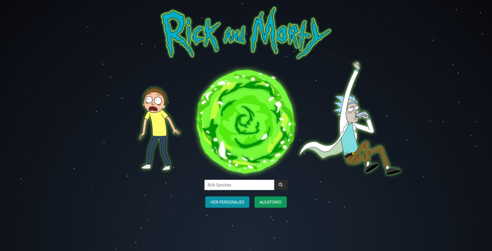
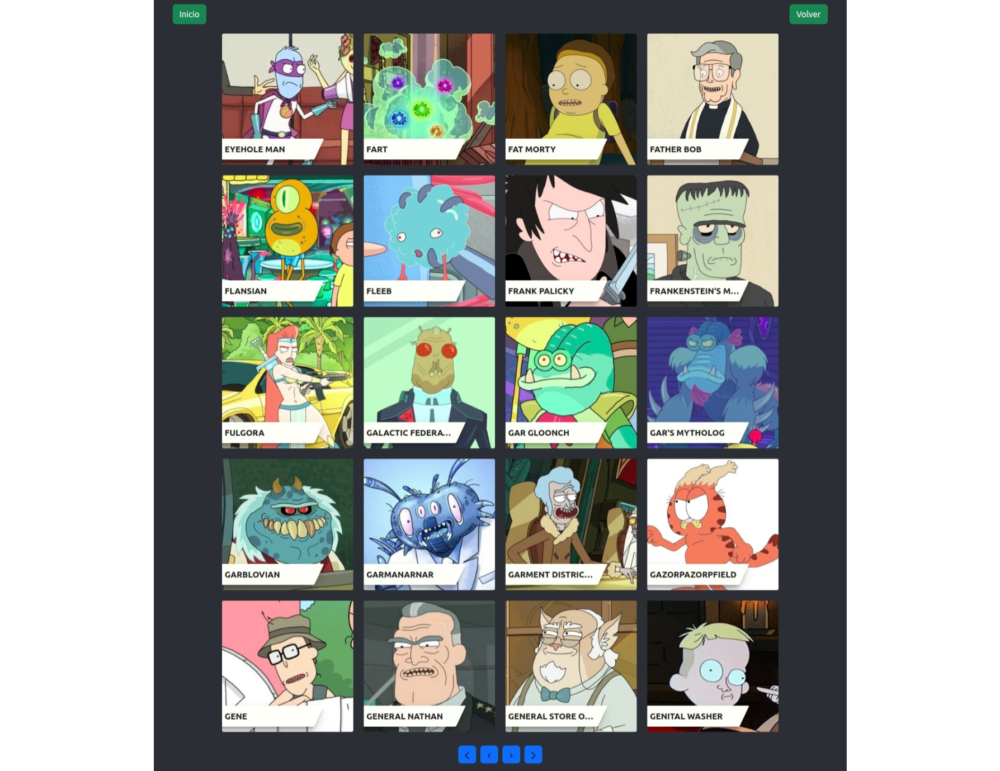

# Rick and Morty character finder

Rick and Morty website where you cand find a read information about the characters of the show.

## Attributions ✅

- [Rick and Morty API](https://rickandmortyapi.com/)

## The challenge ✅

Users should be able to:

- View the optimal layout for the site depending on their device's screen size
- Search for specific characters
- View all characters list
- View information about the characters

## Screenshots 📸

- ### 🖥️ Desktop version
  
  
  

## Links 🔗

- Repo: [Github](https://github.com/RicAlc/rick-and-morty-website)
- Site URL: [Rick and Morty characters](https://ricalc-rickandmorty.netlify.app/)

## Built with 🧰 🛠️

- React
- Sass
- Bootstrap
- Reactstrap
- React icons
- React router
- Axios

## Author 🧑🏽‍💻

- Github - [Ricardo Alcalá](https://www.github.com/RicAlc)
- Twitter - [@\_RicAlc](https://twitter.com/_RicAlc)
